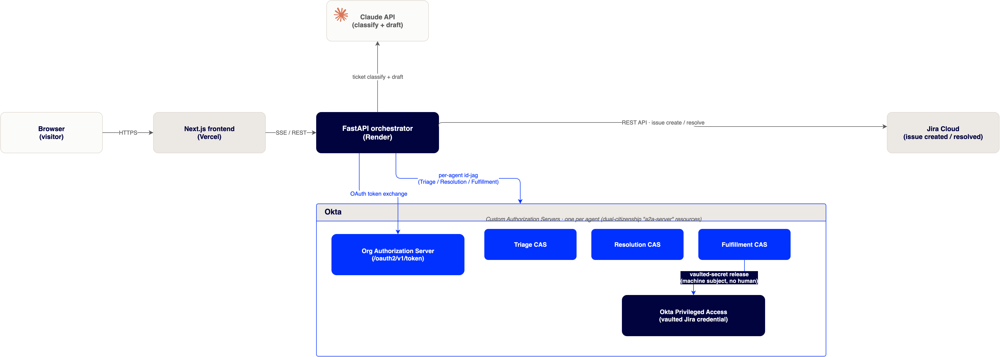
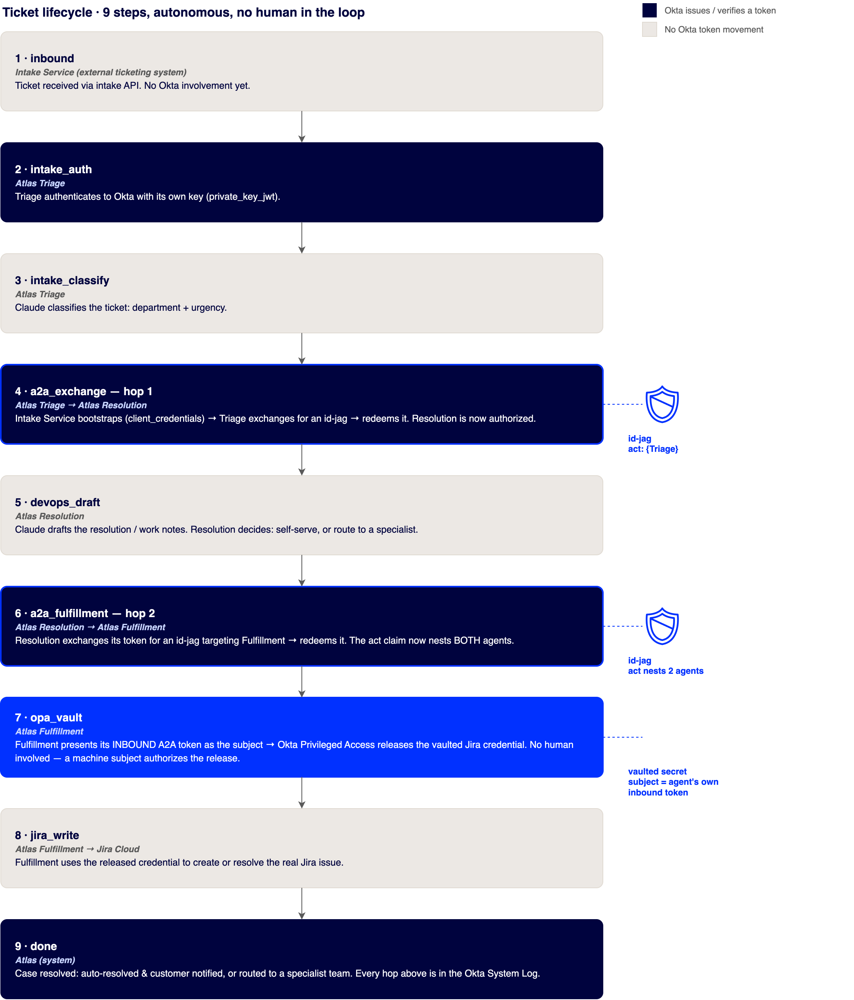

# Atlas Service Desk

**Atlas Service Desk** is a demo of an autonomous IT service desk secured end-to-end by Okta identity. Three AI agents (Triage, Resolution, Fulfillment) triage, resolve, and file real Jira issues with zero humans in the loop, while every hand-off between them is a cryptographically verifiable, Okta-issued token.

It exists to answer one question concretely: **when an AI agent acts, and hands one task to another AI agent, who is accountable, and can you prove it?**

## What it demonstrates

- **Workload identity.** Each agent is a first-class Okta identity with its own key pair (a "workload principal"), not a shared API key copy-pasted into three places.
- **Agent-to-agent (A2A) delegation.** One agent invoking another produces a real Okta-issued token (an ID-JAG) whose `act` claim nests every actor in the chain, a chain of custody, not a log line someone could have faked after the fact.
- **No human in the loop, and no silent bypass either.** The pipeline never pauses for a person to click "approve." Okta's Privileged Access vault still requires *a* subject to release a downstream credential (that's how RFC 8693 token exchange works); this demo proves that subject can be the agent's own delegated authority, not a human's, see [the vault section of the architecture doc](docs/ARCHITECTURE.md#the-vaulted-secret-release-a-machine-authorizes-itself) for exactly how.
- **Real outcomes.** Tickets are actually filed in a real Jira Cloud project, actually auto-resolved (roughly half the time, randomly) or actually routed to a team.

## Try it

Live demo: **https://atlas-desk.vercel.app**, click "Simulate inbound ticket" and watch the pipeline run for real.

Or run it locally, see [Local development](#local-development) below.

## How it works



A browser talks to a Next.js frontend, which streams the pipeline (SSE) from a FastAPI orchestrator. The orchestrator is the only thing that talks to Okta, Claude, and Jira, no credentials of any kind live in the frontend.



The full technical walkthrough, including the exact token-exchange mechanics and two things this repo is honest about *not* getting perfect yet, is in **[docs/ARCHITECTURE.md](docs/ARCHITECTURE.md)**.

Want to build this pattern in your own Okta tenant? **[docs/OKTA_SETUP.md](docs/OKTA_SETUP.md)** is a from-scratch configuration guide, written generically, no tenant-specific values, covering exactly which Okta objects you need and why.

## Tech stack

| | |
|---|---|
| Frontend | Next.js 14 (App Router), React 18, TypeScript, Tailwind CSS, D3, Framer Motion |
| Backend | FastAPI (Python), `python-jose` + `cryptography` for token signing/decoding |
| AI | Anthropic Claude, ticket classification and drafting |
| Identity | Okta Workload Identities, Okta Agent-to-Agent (A2A), Okta Privileged Access |
| Downstream system | Jira Cloud (REST API v3) |

## Local development

```bash
# Backend
cd apps/orchestrator
python3 -m venv .venv && source .venv/bin/activate
pip install -r requirements.txt
uvicorn main:app --reload --port 8080
```

Without Okta/Jira/Claude credentials configured, the backend runs in **demo mode**: the identical event sequence, on safe canned ticket data, with zero external calls. This is enough to see the whole UI and flow working.

```bash
# Frontend, in a second terminal
cd apps/web
npm install
npm run dev   # http://localhost:3002
```

Set `NEXT_PUBLIC_ORCHESTRATOR_URL` in `apps/web/.env.local` to point the frontend at your local orchestrator (`http://localhost:8080`).

To run it fully **live** (real Okta, real Claude, real Jira), see the full environment variable table and setup checklist in [docs/OKTA_SETUP.md](docs/OKTA_SETUP.md).

## Deploying

This instance runs on Vercel (frontend) + Render (backend). See [DEPLOY.md](DEPLOY.md) for the operational runbook for that specific hosting setup.

## Honest limitations

This is a demo built to prove an identity pattern, not a hardened production service:

- CORS on the orchestrator is currently wide open (`allow_origins: *`).
- The orchestrator decodes claims from the tokens Okta hands back to it, but doesn't independently re-verify their signatures. Okta is treated as an already-authenticated first party in this flow, a reasonable simplification here, not a pattern to copy blindly into a context where token verification actually matters.
- If the Okta Privileged Access vault path isn't fully configured, the app falls back to a static environment-variable credential rather than failing closed, and the UI is explicit about which path actually fired (different narration, different System Log event ID or none at all). It never fabricates a vault event that didn't happen. See [docs/ARCHITECTURE.md](docs/ARCHITECTURE.md#honesty-by-design-the-demo-mode--fallback-rule) for the full rule.
- Only two of the three narrated agent identities are currently distinct in the backend implementation. See the callout in [docs/ARCHITECTURE.md](docs/ARCHITECTURE.md#current-implementation-notes).
