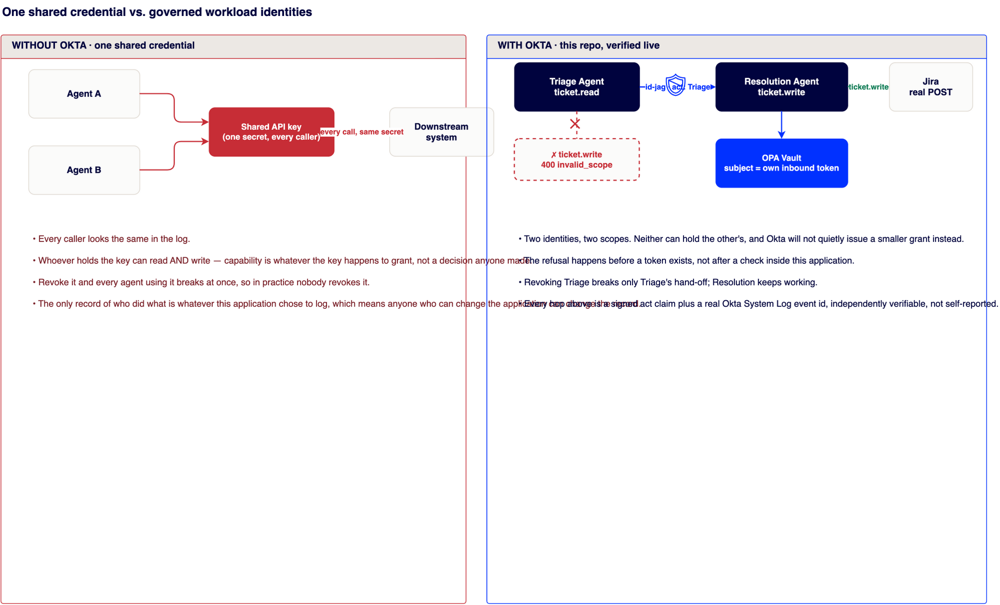
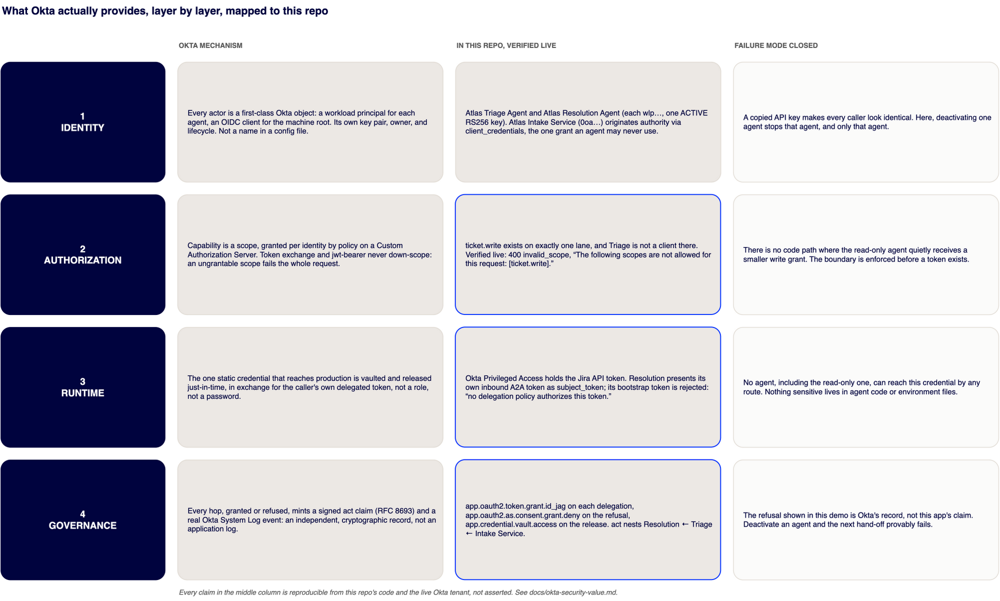

# The Okta security value, verified

This document is the evidence layer. [WHY-THIS-MATTERS.md](WHY-THIS-MATTERS.md) makes the plain-language case with no mechanics. [ARCHITECTURE.md](ARCHITECTURE.md) explains the full mechanics. This page sits between them: for each claim, what Okta mechanism backs it, what this repo shows against a live tenant, and what failure mode is structurally closed as a result.

Every claim below is reproducible. Run `python3 scripts/verify_live.py` against a deployed orchestrator and it checks the signed tokens, the per-hop scopes, the nested `act` chain, and the write refusal directly. Nothing here is asserted on faith.

## Without Okta, with Okta

**Without Okta**, a shared API key makes every caller indistinguishable, grants whatever the key happens to carry rather than what anyone decided, and cannot be revoked for one agent without breaking every agent. The only record of who did what is whatever the application chose to log.

**With Okta**, in this repo: two workload principals, two scopes, and neither can hold the other's. The refusal happens before a token exists, not after an in-application check. Revoking Triage breaks only Triage's hand-off; Resolution keeps working. Every hop is a signed `act` claim plus a real Okta System Log event, independently verifiable rather than self-reported.

## The four layers, verified live

| Layer | Okta mechanism | Verified live, in this repo | Failure mode closed |
|---|---|---|---|
| **Identity** | Every actor is a first-class Okta object: a workload principal per agent, an OIDC client for the machine root. Its own key pair, owner, and lifecycle, not a name in a config file. | Atlas Triage Agent and Atlas Resolution Agent each hold exactly one ACTIVE RS256 key. The Atlas Intake Service (`0oa…`) originates authority via `client_credentials`, the one grant type an agent may never use. | A copied API key makes every caller look identical. Here, deactivating one agent stops that agent, and only that agent. |
| **Authorization** | Capability is a scope, granted per identity by policy on a Custom Authorization Server. Token exchange and `jwt-bearer` never down-scope: a request naming an ungrantable scope fails in full rather than issuing the grantable subset. | `ticket.write` exists on exactly one lane, and Triage is not a client there. Verified live: `400 invalid_scope`, "The following scopes are not allowed for this request: [ticket.write]." | There is no code path where the read-only agent quietly receives a smaller write grant. The boundary is enforced before a token exists. |
| **Runtime** | The one static credential that reaches production is vaulted and released just in time, in exchange for the caller's own delegated token, not a role, not a password. | Okta Privileged Access holds the Jira API token. Resolution presents its own inbound A2A token as `subject_token` and it is accepted. Its bootstrap token, presented the same way, is rejected: "no delegation policy authorizes this token." | No agent, including the read-only one, can reach this credential by any route. Nothing sensitive lives in agent code or environment files. |
| **Governance** | Every hop, granted or refused, mints a signed `act` claim (RFC 8693) and a real Okta System Log event: an independent, cryptographic record, not an application log. | `app.oauth2.token.grant.id_jag` on each delegation, `app.oauth2.as.consent.grant.deny` on the refusal, `app.credential.vault.access` on the release. The `act` claim nests Resolution ← Triage ← Intake Service. | The refusal shown in this demo is Okta's record, not this app's claim. Deactivate an agent and the next hand-off provably fails. |

## What this doc is not

It is not a substitute for [ARCHITECTURE.md](ARCHITECTURE.md), which walks the full three-call token-exchange mechanics, the vaulted-secret release, and the two things this repo does not yet get all the way right. It is the citation trail for the value claims: the specific error strings and log event names that make "Okta refuses" a reproducible fact rather than a slide.

To build the same boundary in your own tenant, start with [OKTA_SETUP.md](OKTA_SETUP.md).
